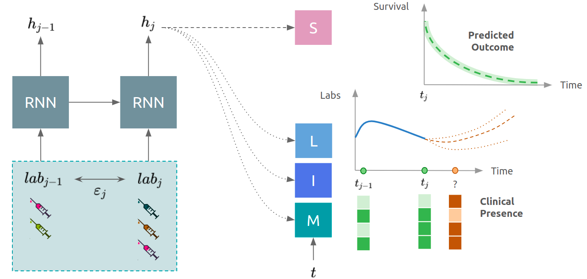

# ClinicalPresence
Code to reproduce the results of the paper [DeepJoint: Robust Survival Modelling Under Clinical Presence Shift](http://arxiv.org/abs/2205.13481). This paper shows how modelling the interaction between patient and the healthcare system in a multi task setting might improve both predictive performance and robustness to change in the observational process.

## Model
The model consists in a recurrent neural network with input each new observation. The embedding is then used for modelling the survival outcome using a DeepSurv model S, and in parallel the observation process:
- L: the longitudinal evolution using a neural network with output the mean and variance of the different laboratory tests.
- I: the inter-observation times using a temporal point process network with output the intensity function.
- M: the missingness process using a neural network with a Bernoulli output.



## How to use the model ?
To use the model, one needs to execute:
```python
from models import RNNJoint
model = RNNJoint(inputdim, outputdim, **hyperparameter)
model.fit(covariates, inter_observation, mask, event, time)
model.predict(covariates, inter_observation, mask)
```

## Reproduce paper's results
To reproduce the paper's results:

0. Clone the repository with dependencies: `git clone git@github.com:Jeanselme/ClinicalPresence.git --recursive`.
1. Create a conda environment with all necessary libraries `pytorch`, `pandas`, `numpy`.
2. Download the MIMIC III dataset and extracts data following `1. MIMIC - Temporal Lab Extraction.ipynb`.
3. Then sub select the laboratory of interest using `2. MIMIC - Analysis.ipynb`.
4. And finally run the experiments `3. MIMIC - Death - Survival.ipynb`, run the notebook with the different split of interest (weekend, weekday or random) -- `Script.py` allows to run this same set of experiments in command line.
5. Analyse the results using `4. MIMIC - Analysis Results.ipynb`.
## Future directions
- Competing risks.
- MIMIC IV.

# Setup
## Structure
All models are in `models` folder, itself divided in the RNN structure, the Observational and Survival components. All scripts are at the root.

## Clone
```
git clone git@github.com:Jeanselme/ClinicalPresence.git --recursive
```

## Requirements
The model relies on `pytorch`, `pandas`, `numpy` and `tqdm`.  
